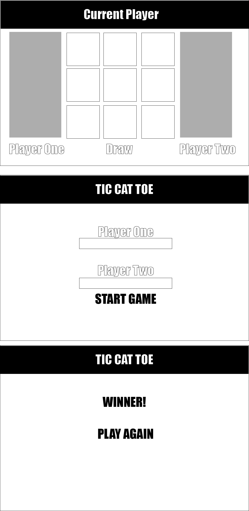

Tic Tac Toe Application

Technologies:
JavaScript
HTML
CSS

Goal: Develop a Tic Tac Toe Application

Approach:
To begin, I utilized an object oriented approach towards structuring my data. The following decisions were made from the beginning:

Made a Game Class to encapsulate the logic of the application

User Class will encapsulate the players of the game. This will allow of users to customize their name and marker

Session class will keep track of the sessions of the game. This will allow users to see the rounds of the game

Road Blocks:
Implementing the Session class took some strategic thinking. Correlating it with an instance of the game class did not work and cause the sessions to be lost after a new game.
The approach I took for now was to create a class that allows for me to wrap the Game class in a static variable:

`class Session { `

`static totalGamesPlayed = [];`

`}`

Thus I was able to instantiate a Game instance while pushing it to the Session class variable:

`Session.totalGamesPlayed.push(new Game(userOne, userTwo))`

Wireframes:

As an approach I had wanted to focus on a 3 scenario situation where the user is able to input thier name and a win screen is shown.




Win Logic:
The win logic was an area that went through massive refactoring. I had to essentially create a set of win conditions, base cases and then compared.
This give me a worse case complexity of n = 72 I believe which is nice and consistent.

```
checkWinner() {
        let winCondition = false
        let set = [
            //top
            [this.board[0][1].innerText, this.board[0][0].innerText, this.board[0][2].innerText],
            //middle
            [this.board[1][1].innerText, this.board[1][0].innerText, this.board[1][2].innerText],
            //bottom
            [this.board[2][1].innerText, this.board[2][0].innerText, this.board[2][2].innerText],
            //middle column
            [this.board[0][1].innerText, this.board[1][1].innerText, this.board[2][1].innerText],
            //last column
            [this.board[0][2].innerText, this.board[1][2].innerText, this.board[2][2].innerText],
            //diagnol
            [this.board[0][0].innerText, this.board[1][1].innerText, this.board[2][2].innerText],
            //reverse diagnol
            [this.board[2][0].innerText, this.board[1][1].innerText, this.board[0][2].innerText],
            //first Column
            [this.board[0][0].innerText, this.board[1][0].innerText, this.board[2][0].innerText]
        ]

        set.forEach((e, index) => {
            let player = [this.currentPlayer.marker, this.currentPlayer.marker, this.currentPlayer.marker].toString()
            if (e.toString() === player) {
                // this.resetGame()
                winCondition = true;
            }
        })
        return winCondition
    }//end check
}
```
Future Objectives:
Implement Web Sockets
I currently implemented socket io on a separate branch. The goal is expand that to be inclusive of multiplayer ability.
